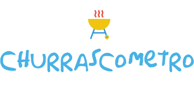
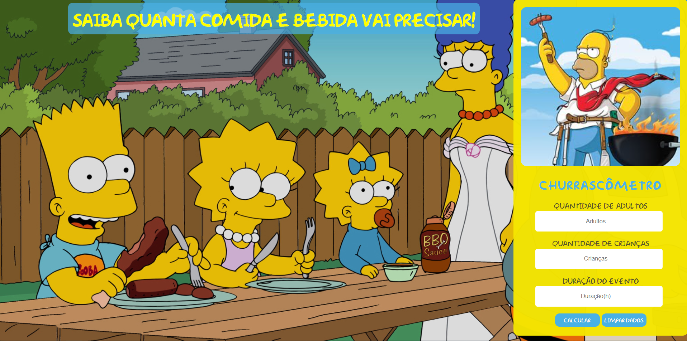
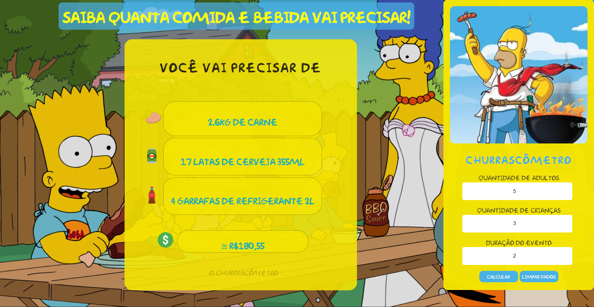

   

	
  

  
  

 

Página inicial
  

Página de resultado
  

  <a href="#clipboard-sobre-o-projeto">Sobre o Projeto</a>&nbsp;&nbsp;&nbsp;|&nbsp;&nbsp;&nbsp;
  <a href="#computer-tecnologias-utilizadas">Tecnologias</a>&nbsp;&nbsp;&nbsp;|&nbsp;&nbsp;&nbsp;
  <a href="#computer-tecnologias-utilizadas">Licença</a>

## :clipboard: Sobre o Projeto

Projeto com finalidade de ajudar o usuário a determinar quanta comida e bebida vai precisar para fazer um churrasco. 
O usuário também terá uma estimativa do custo em reais(BRL) aproximado de quanto irá gastar.
 
 
Cálculos realizados com base nas informações seguintes:
 

- Carne: 400g por pessoa, se o evento tiver mais de 6h de duração passa a a ser 650g por pessoa

- Cerveja: 1.2L por pessoa, se o evento tiver mais de 6h de duração passa a a ser 2L por pessoa

- Refrigerante: 1L por pessoa, se o evento tiver mais de 6h de duração passa a a ser 1.5L por pessoa

- Para crianças as quantidades valem 1/2(metade) e não bebem cerveja

- R$30,00 por cada Kg de carne 

- R$4,39 cada lata de cerveja de 355ml

- R$6,98 cada garrafa de refrigerante de 2L

## :computer: Tecnologias utilizadas

O projeto foi desenvolvido utilizando as seguintes tecnologias:

- JavaScript
- HTML
- CSS

## :closed_book: Licença

Esse projeto está sob a licença MIT. Veja o arquivo [LICENSE](https://github.com/JonathanCB99/churrascometro-simpsons/blob/main/LICENSE) para mais detalhes.

